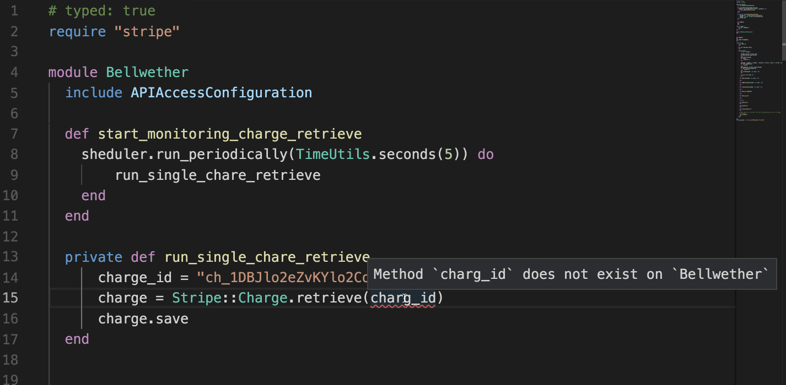
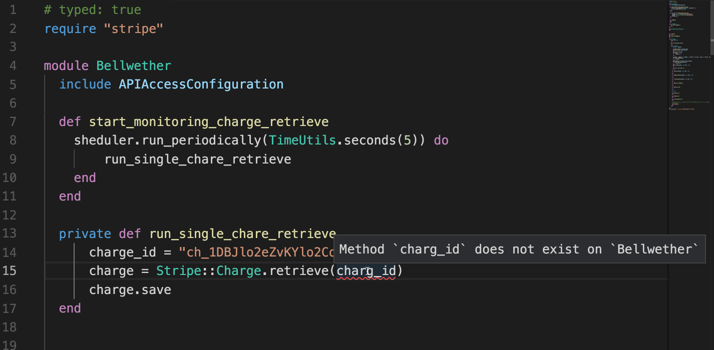
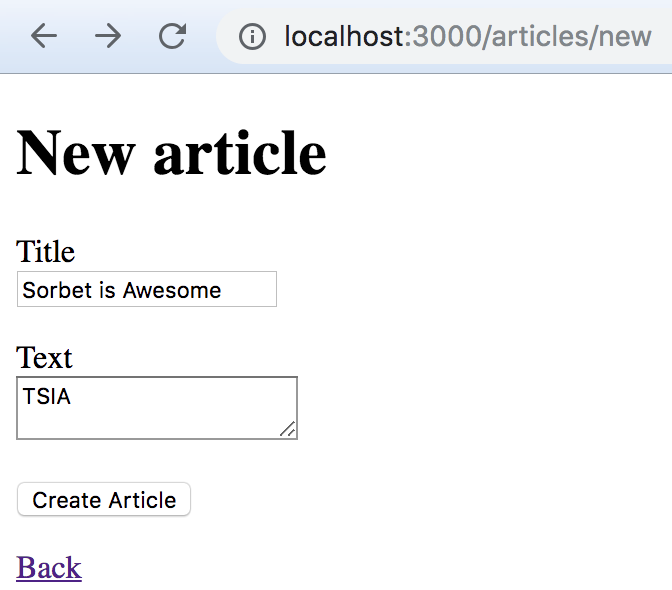

- **About Stripe**

- Adopting Sorbet at Stripe

- Editor Tools for Sorbet

- Announcements

- Sorbet Tooling

---

## Stripe

- Platform that developers use to accept payments
- 32 countries, millions of business worldwide
- Billions of dollars of processing volume annually
- More than 80% of American adults bought something on Stripe in 2017
- 1,700 people in 10 offices around the world
- Customers report 59% more developer productivity after deploying Stripe
- We're hiring! → [stripe.com/jobs](https://stripe.com/jobs)

---

## Developer Productivity

- Testing
- Code
- Dev Env
- Abstractions
- Language Tools
- Docs
- Platform Teams
- Etc.

Note:

- I'm the Tech Lead
- Responsible from the moment you `git branch` until your code is in prod
- If a Stripe developer is having a bad day, it is our problem

---

## Ruby at Stripe

- Ruby is the primary programming language
  - Enforced subset of Ruby (Rubocop!)
  - Not using Rails
- Most product code is in a monorepo (intentionally!)
  - ~10 macroservices with a few microservices
  - New code mostly goes into an existing service

Note:

- Millions of lines of Ruby

---

## Scale of Engineering at Stripe

- Hundreds of engineers
- Thousands of commits per day
- Millions of lines of code

Note:

- Top languages
- Most product engineers use Ruby.
- Next language is 2% - bash

---

## Collaboration

- **Jeff Foster** (PLUM/Tufts) – RDL
- **@charliesome** (GitHub) – Ruby Parser
- **@soutaro** – Steep
- **@mame** – Type profiler
- **Matz** – Ruby
- **Shopify** – Core Sorbet contributor
- **Coinbase** – Core Sorbet contributor
- **Sourcegraph** – Core Sorbet contributor

Note:
- soutaro-san
- mame-san

---

- About Stripe

- **Adopting Sorbet at Stripe**

- Editor Tools for Sorbet

- Announcements

- Sorbet Tooling

---

## Adopting Sorbet at Stripe

- **8 months** building from scratch (Oct 2017 – May 2018)
- **7 months** rolling out (Jun 2018 – Dec 2018)
- **4+ months** on editor and OSS tooling (Jan 2019 – ···)

---

## Adopting Sorbet at Stripe

- **8 months** building from scratch (Oct 2017 – May 2018)
- <span style="opacity: 0.3;">**7 months** rolling out (Jun 2018 – Dec 2018)</span>
- <span style="opacity: 0.3;">**4+ months** on editor and OSS tooling (Jan 2019 – ···)</span>

---

## Adopting Sorbet at Stripe

- <span style="opacity: 0.3;">**8 months** building from scratch (Oct 2017 – May 2018)</span>
- **7 months** rolling out (Jun 2018 – Dec 2018)
- <span style="opacity: 0.3;">**4+ months** on editor and OSS tooling (Jan 2019 – ···)</span>

---

### Uninitialized constant errors

```ruby

class Hello

end

def main
  puts Helo.new
end

main
```

<pre><code>


</code></pre>

Note:

Focused on identifying then preventing errors.

---

### Uninitialized constant errors

```ruby

class Hello

end

def main
  puts Helo.new
end

main
```

```console
❯ ruby hello.rb
hello.rb:7:in `main': uninitialized constant Helo (NameError)
Did you mean?  Hello
        from hello.rb:12:in `<main>'
```

Note:

- Maybe we'll hear about it in 15 minutes when the tests catch it
- Maybe we'll hear about it later that day when we deploy the change
- Maybe we'll hear about it Sunday night at 2:00 a.m. from a very upset user

---

### Uninitialized constant errors

```ruby

class Hello

end

def main
  puts Helo.new
end

main
```

```console
❯ srb
hello.rb:7: Unable to resolve constant `Helo`
     7 |  puts Helo.new
               ^^^^
```

Note:

- Did we actually succeed in preventing these kinds of errors?

---

### 🎉 100% of Ruby files at Stripe!

```ruby

class Hello

end

def main
  puts Helo.new
end

main
```

```console
❯ srb
hello.rb:7: Unable to resolve constant `Helo`
     7 |  puts Helo.new
               ^^^^
```

---

### Undefined method errors

```ruby

class Hello
  def greeting; 'Hello, world!'; end
end

def main
  puts Hello.new.greet
end

main
```

<pre><code>


</code></pre>

---

### Undefined method errors

```ruby

class Hello
  def greeting; 'Hello, world!'; end
end

def main
  puts Hello.new.greet
end

main
```

```console
❯ ruby hello.rb
hello.rb:7:in `main': undefined method `greet'
Did you mean?  greeting
        from hello.rb:10:in `<main>'
```

Note:

We'd like to be able to use Sorbet to gain even more confidence than tests
alone.

---

### Undefined method errors

```ruby
# typed: true
class Hello
  def greeting; 'Hello, world!'; end
end

def main
  puts Hello.new.greet
end

main
```

```console
❯ ruby hello.rb
hello.rb:7:in `main': undefined method `greet'
Did you mean?  greeting
        from hello.rb:10:in `<main>'
```

---

### Undefined method errors

```ruby
# typed: true
class Hello
  def greeting; 'Hello, world!'; end
end

def main
  puts Hello.new.greet
end

main
```

```console
❯ srb
hello.rb:7: Method greet does not exist on `Hello`
     7 |  puts Hello.new.greet
               ^^^^^^^^^^^^^^^
```

---

### 🎉 80% of Ruby files at Stripe!

```ruby
# typed: true
class Hello
  def greeting; 'Hello, world!'; end
end

def main
  puts Hello.new.greet
end

main
```

```console
❯ srb
hello.rb:7: Method greet does not exist on `Hello`
     7 |  puts Hello.new.greet
               ^^^^^^^^^^^^^^^
```

Note:

Why only 80%?

Getting files into `typed: true` means fixing a lot of errors!
We built tools to automate the process, but it's still work.

---

### More than just errors

- What types does this method take?
- Could this thing be nil?

---

### &nbsp;

```ruby

def do_thing(x)
  # ...
end

do_thing('some string')  # is this ok?
do_thing(nil)            # is this ok?
```

---

### &nbsp;

```ruby
sig {params(x: String).void}
def do_thing(x)
  # ...
end

do_thing('some string')  # is this ok?
do_thing(nil)            # is this ok?
```

---

### &nbsp;

```ruby
sig {params(x: String).void}
def do_thing(x)
  # ...
end

do_thing('some string')  # 😎 this is ok!
do_thing(nil)            # ❌ this is not ok!
```

---

### 🎉 62% of methods at Stripe have a signature!

```ruby
sig {params(x: String).void}
def do_thing(x)
  # ...
end

do_thing('some string')  # 😎 this is ok!
do_thing(nil)            # ❌ this is not ok!
```

---

### ⏪ Recap: What we achieved

- **100%** of files: catch uninitialized constants!
- **81%** of files: catch NoMethodError's!
- **62%** of methods have signatures!

Note:

- Proud of our progress, versus our peers, and how early stage we are
- We like to think our progress is because of how well designed Sorbet is

---

## What our users say

---

### A tool for understanding


---

### An interactive experience


---

### Sorbet editor extension


Note:

One weekend, Dmitry built a prototype of an editor extension integrating Sorbet.

---

## What we learned

- Sorbet is powerful enough to fit many needs
- People want Sorbet in their editor
- Automated tooling can make adoption faster

Note:

At first, we would have been ok with taking 20 minutes.
Now, we're getting asked for *sub-second* response times.

---

## Adopting Sorbet at Stripe

- <span style="opacity: 0.3;">**8 months** building from scratch (Oct 2017 – May 2018)</span>
- **7 months** rolling out (Jun 2018 – Dec 2018)
- <span style="opacity: 0.3;">**4+ months** on editor and OSS tooling (Jan 2019 – ···)</span>

---

## Adopting Sorbet at Stripe

- <span style="opacity: 0.3;">**8 months** building from scratch (Oct 2017 – May 2018)</span>
- <span style="opacity: 0.3;">**7 months** rolling out (Jun 2018 – Dec 2018)</span>
- **4+ months** on editor and OSS tooling (Jan 2019 – ···)

---

- About Stripe

- Adopting Sorbet at Stripe

- **Editor Tools for Sorbet**

- Announcements

- Sorbet Tooling

---

### VS Code



Note:
- Don't say LSP

---

### Errors & Hover



---

### Go To Definition


---

### Autocomplete + Docs


---

## Try it yourself!

https://sorbet.run

(IDE features only work on desktop)

---

### Code Browsing (by Sourcegraph)


Note:

- Sourcegraph is a web-based code search and navigation tool for dev teams.

- After Sorbet is open sourced, tools like this will follow.

- Get in touch!

---

- About Stripe

- Adopting Sorbet at Stripe

- Editor Tools for Sorbet

- **Announcements**

- Sorbet Tooling

---

## 🎉 Ruby 3 & Types!

- Ruby 3 stdlib will ship with type definitions
- We're collaborating closely with the Ruby core team
- See talks by **@matz**, **@soutaro**, and **@mame**

---

## 🎉 Open source soon!

- Already in Private Beta
  - 3 other core companies contributed code
  - 5 testing it as users
- Want in?
  - <sorbet@stripe.com>
  - Describe your setup (LOC? number of contributors?)

Note:
- Coinbase
- Shopify
- SourceGraph

---

## Why not open source yet?

- Philosophy: Make experience great
  - Slowly expand private beta
  - Mix of small, medium, and large codebases
  - Once the experience is good for a batch, ship it
- Date: Summer 2019
- https://stripe.com/blog

Note:
If the conference organizers had done it the same time as last year we might
have something else to announce :)

---

## 🎉 https://sorbet.org

We are releasing the docs today!

---

## 🎉 Open source tooling

Sneak peak:

```ruby
# Gemfile
gem 'sorbet', :group => :development
gem 'sorbet-runtime'
```

```bash
❯ srb init
...
```

```bash
❯ srb
No errors! Great job
```

Note:
- We are deploying using standard Ruby tooling

---

- About Stripe

- Adopting Sorbet at Stripe

- Editor Tools for Sorbet

- Announcements

- **Sorbet Tooling**

---

## An Initialized Project

```bash
sorbet/
│ # Default options to passed to sorbet on every run
├── config
└── rbi/
    │ # Community-written type definition files for your gems
    ├── sorbet-typed/
    │ # Autogenerated type definitions for your gems
    ├── gems/
    │ # Things defined when run, but hidden statically
    ├── hidden-definitions/
    │ # Constants which were still missing
    └── todo.rbi
```

---

## `sorbet-typed` (by Coinbase)

https://github.com/sorbet/sorbet-typed/

> A central repository for sharing type definitions for Ruby gems

Note:
- A way to share type definitions for gems

---

## DSL Extension (by Shopify)

```ruby
attribute my_id, :integer
```

becomes

```ruby
sig {returns(T.nilable(Integer))}
def my_id; end

sig {returns(T::Boolean)}
def my_id?; end

sig {params(new_value: T.nilable(Integer)).void}
def my_id=(new_value); end
```

Note:
- You can teach sorbet about your DSL

---

## Implementation

```ruby
attribute my_id, :integer
```

```bash
❯ srb tc --dsl-plugins plugins.yaml
```

```yaml
# plugins.yaml
attribute: attribute.rb
```

```ruby
# attribute.rb
prop, type = STDIN.gsub("attribute ", "").delete(":").split(",")

puts "sig {returns(T.nilable(#{type.upcase}))}"
puts "def #{prop}; end"
...
```

```ruby
sig {returns(T.nilable(Integer))}
def my_id; end
...
```

---

## Typechecking Rails

```
❯ rails new blog
```

<div style="height:400px">

</div>

---

## It typechecks!

```bash
❯ git grep -h typed: | sort | uniq -c
    2 # typed: false
  120 # typed: true
```

Note:
- 98.3% of files are true

---

## RubyGems.org

```bash
❯ git grep -h typed: | sort | uniq -c
  189 # typed: false
  265 # typed: true
```

- Real codebase
- 58% `typed: true` out of the box

---

## Gitlab

```bash
❯ git grep -h typed: | sort | uniq -c
    47 # typed: ignore
  6516 # typed: false
  1579 # typed: true
```

- Big codebase
- 99% `typed: false` or better
- 19% `typed: true` out of the box

---

## Typechecking Rails

- Only needed 7 hand-written type signatures
- 1 new feature
- Most other signatures are autogenerated by reflection

---

## Closing

- Editors under active development
- Open sourcing very soon!
  - Already in private beta with 8 folks
- Works with Rails
- Docs are live at [sorbet.org](https://sorbet.org)

---

# Thank you!

Brace yourselves, Sorbet is coming

[sorbet.org](https://sorbet.org)

 <!-- .element: style="background: inherit; border: 0; box-shadow: none" -->
